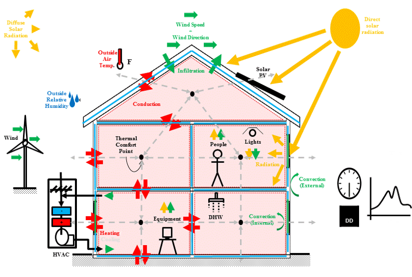

```{r setup, include=FALSE}

# set global settings to hide console messages from markdown document
knitr::opts_chunk$set(eval = TRUE, echo = TRUE, message = FALSE, warning = FALSE, cache = FALSE)

# load required libraries
library("tidyverse")
library("eplusr")
library("lubridate")
library("ggpubr")


```

# Introduction

In this session, we will use a relatively new R package called [`eplusr`](https://hongyuanjia.github.io/eplusr/index.html) to modify building energy model parameters, run simulations directly in R, retrieve the simulation results, and perform some analysis on it. `eplusr` facilitates programmatic navigation, modification, extraction of simulation parameters and results to quickly perform parametric analysis. The simulation engine that we will be working is called [EnergyPlus](https://energyplus.net/). EnergyPlus is a free, open-source, and cross-platform simulation engine that engineers, architects, and researchers use to model energy and water consumption use in buildings. EnergyPlus is based on first principles models that have been extensively validated and therefore a popular simulation engine choice among researchers.

## Background on whole building energy model and simulation

The goal of whole building energy simulation is to extract information from a system by exercising its inputs to learn behaviors of that system in an inexpensive format and at a timescale that is reasonable. In order to do this, you first need to build an energy model which is just a mathematical representation of a building and its internal and external environment interactions as shown in the figure below . Then you can perform virtual experiments on the model through simulations. A successful simulation will have a well-defined system indicating the object or collection of objects whose properties you want to study and its relevant interaction. In short, you don't have to construct an actual building and wait a year to learn if a set of new high performing windows are worth the cost.

Other uses for whole building energy simulation is to learn the behavior of buildings at worst case scenarios e.g. outdoor temperatures at the extreme and/or a loss of power. This is becoming an important issue in the context of climate change and resilient buildings. You can also use whole building energy simulation to quantify the improvement of high performing buildings to existing energy codes which are the lowest energy performing buildings can be legally constructed. This is important in green certification rating systems like LEED.

# Setting up R to run EnergyPlus

Like we learned before, the first part of the script is to setup the working environment by loading in the necessary packages, and in this case the external software (EnergyPlus) that we will be using. Since we are installing external software, we need to open Rstudio with administrator privileges. To do this, we can simply right click on the Rstudio application icon and select 'Run as administrator'.

``` {r}

# install eplusr and supporting library if not already installed
if(!require("eplusr")) install.packages(c("decido", "eplusr"), repos = "http://cran.us.r-project.org")


# install the EnergyPlus simulation engine if not already installed
# make sure you open Rstudio with administrator privileges
if(!any('9.0.1' == eplusr::avail_eplus())) eplusr::install_eplus(ver = "9.0.1")

```


Load the required library into the current R session environment.
``` {r}


# load the packages
library(tidyverse)
library(eplusr)
library(lubridate)
library(ggpubr)

```


Lets verify that EnergyPlus was installed and available on our computers. The output of the line of code below should be a list of EnergyPlus versions.

``` {r}

# verify EnergyPlus installation
avail_eplus()

```


Now lets tell R which version of EnergyPlus we will be using. This is especially crucial if you have multiple EnergyPlus installations on your computer. We installed and selected EnergyPlus version `9.0.1` because that is the version of the EnergyPlus models that we will be working with. The latest version of EnergyPlus is version 9.6.

``` {r}

# specify EnergyPlus version to use in this session
eplus_config("9.0.1")

```

Finally, we define various folders inside R that will make it easier to navigate through the various files that we need and create when running an EnergyPlus simulation.

``` {r}

# define a project, model, weather, and simulation folders
project_folder <- file.path(".")

model_folder <- file.path(project_folder, "models")

weather_folder <- file.path(project_folder, "weather")

simulation_folder <- file.path(project_folder, "simulations")

```


# Importing building model and weather data

The next steps involve importing the files that we need in order to run an EnergyPlus simulation. These are the building energy model and the weather files. We can inspect the contents of the folders we just defined to see what is in them by using the command `dir`.

``` {r}

# inspect the contents of the model folder
# should contain two folders
dir(model_folder)

# repeat the command on one of the folders
dir(file.path(model_folder, "medium_office"))

```


We can do the same for the weather folder.

``` {r}

# inspect the contents of the model folder
dir(weather_folder)

```


Hopefully, you see a list of files with extensions `.idf` and `.epw`. Files with extension `.idf` are the files that contain an EnergyPlus building energy model. The energy models that we are using are [prototype building models](https://www.energycodes.gov/prototype-building-models) that represent a typical building type define to a specific building energy code. We are using energy models specified with ASHRAE standard 90.1-2019. The 'idf' stands for input data file and it contains human readable text that defines the parameters of the model e.g. geometry of the building, type of windows and walls, properties of the equipment that consume energy in a building including the schedules that dictate when the equipment operate. You can open this file in any text reader application and you will be able to read the different objects that define the model.

Files with the extension `.epw` are files that contain weather information for a specific location. The weather file provides the external conditions to our experiment (simulation). The 'epw' stands for EnergyPlus weather. However, it is not only for EnergyPlus. Many applications have adopted this standard representation for weather data. For example, you can do a quick climate analysis based on these `.epw` files using [CBE's Clima Tool](https://clima.cbe.berkeley.edu/). 

The data contain within this type of `.epw` file is just the common comma-separated values (CSV). Thus, you can open it in any spreadsheet application like excel or even import it into R using the tidyverse function `readr::read_csv()` introduced earlier in the course. You will need to refer to [EnergyPlus Weather File (EPW) Data Dictionary](https://bigladdersoftware.com/epx/docs/9-0/auxiliary-programs/energyplus-weather-file-epw-data-dictionary.html#energyplus-weather-file-epw-data-dictionary) in order know what each line and column of information means within the file.


We now can define two variables where one of them contains the path to the energy model and the other to the path to the corresponding weather file.

``` {r}

# define variables to hold relevant file paths
model_file <- file.path(model_folder, "medium_office", "ASHRAE901_OfficeMedium_STD2019_SanDiego.idf")
weather_file <- file.path(weather_folder, "USA_CA_San.Deigo-Brown.Field.Muni.AP.722904_TMY3.epw")

```

Note that we just defined the variables but we have not loaded anything into our R session. This is where the `eplur` package comes into play. We use the package to load the information contained within these files. `eplur` parses the text file and assigns R objects and properties that we will use to facilitate the navigation and modification of the files.

``` {r}

# load model
model <- read_idf(model_file)

# load weather file
weather_data <- read_epw(weather_file)

```


# Inspect the model

## Text print out of class object

We can do a quick inspection of the model we just loaded in by printing out the contents of the variable `model`.

``` {r}

# get an overview of the contents in the model
print(model)

```

This summary contains the different types of class objects used to build the energy model. The class objects are organized by group. The summary also lets us know the number of objects per class that are included in the energy model. We can further dive into the properties contained within the model. We can figure out which properties are available by using the `names` function on the `model` variable. Calling on these properties will allow us to programmatically query and modify EnergyPlus models.

``` {r}

print(names(model))

```

A cleaner version of the properties with their functionality. 

| Category            | Method/Property          | Functionality                                         |
| :---                | :---                     | :---                                                  |
| Basic Info          | `$version()`             | Get Idf version                                       |
|                     | `$path()`                | Get Idf file path                                     |
|                     | `$group_name()`          | Get group names                                       |
|                     | `$class_name()`          | Get class names                                       |
|                     | `$is_valid_group()`      | Check group existence                                 |
|                     | `$is_valid_class()`      | Check class existence                                 |
| Definition          | `$definition()`          | Get corresponding `IddObject`                         |
| Object Info         | `$object_id()`           | Get object unique ID                                  |
|                     | `$object_name()`         | Get object name                                       |
|                     | `$object_num()`          | Get object number in class                            |
|                     | `$is_valid_id()`         | Check object ID existence                             |
|                     | `$is_valid_name()`       | Check object name existence                           |
| Object Relation     | `$object_relation()`     | Get object relation with others                       |
| Object Query        | `$object()`              | Get single object                                     |
|                     | `$objects()`             | Get multiple objects                                  |
|                     | `$object_unique()`       | Get the unique object                                 |
|                     | `$objects_in_class()`    | Get objects in class                                  |
|                     | `$objects_in_group()`    | Get objects in group                                  |
|                     | `$objects_in_relation()` | Get objects in relation                               |
|                     | `$search_object()`       | Get objects using regular expression                  |
| Object Modification | `$dup()`                 | Duplicate objects                                     |
|                     | `$add()`                 | Add new objects                                       |
|                     | `$set()`                 | Modify existing objects                               |
|                     | `$del()`                 | Delete existing objects                               |
|                     | `$purge()`               | Delete unused resource objects                        |
|                     | `$duplicated()`          | Detect duplicated objects                             |
|                     | `$unique()`              | Delete duplicated objects                             |
|                     | `$rename()`              | Change object names                                   |
|                     | `$insert()`              | Add new objects from other `IdfObject`s               |
|                     | `$load()`                | Add new objects from strings and data.frames          |
|                     | `$update()`              | Update object values from strings and data.frames     |
|                     | `$paste()`               | Add new objects from IDF Editor `Copy obj`            |
|                     | `$search_value()`        | Get objects whose values match regular expression     |
|                     | `$replace_value()`       | Modify object values using regular expression         |
| Validation          | `$validate()`            | Check any errors in `Idf`                             |
|                     | `$is_valid()`            | Check if no error exists in `Idf`                     |
| Data Extraction     | `$to_table()`            | Extract `Idf` data in data.frames                     |
|                     | `$to_string()`           | Extract `Idf` data in strings                         |
| Save                | `$is_unsaved()`          | Check if unsaved changes exist                        |
|                     | `$save()`                | Save `Idf` to an `.idf` file                          |
| Clone               | `$clone()`               | Create an copy                                        |
| Run                 | `$run()`                 | Run `Idf` together with an `Epw`                      |
| Geometry            | `$geometry()`            | Extract `Idf` geometry and perform operations on them |
|                     | `$view()`                | Show `Idf` 3D geometry using the rgl package          |
| Print               | `$print()`               | Print `Idf` in different details                      |


We can also use the `$definition` property to learn more about a specific class.

``` {r}

# get information on a specific class such as Lights
model$definition("Lights")

# get information on the Material object class
model$definition("Material")

```

If you still need more information, you can also refer to the [EnergyPlus Input Output Reference](https://bigladdersoftware.com/epx/docs/9-0/input-output-reference/). This document offer detailed descriptions of the class objects along with descriptions of each field.

We can use the property `$object_name` to retrieve a list of the unique names for each instance that the object class is used in the energy model. 

```{r}

# retrieve all the names of the Lights object class
model$object_name("Lights")

# retrieve all the names of the Material object class
model$object_name("Material")
```

Then, we can use one of the unique names to retrieve the exact parameters used to define the specific object using the property `$objects`.

```{r}

# get the specific parameters define for one of the light objects
model$objects("Core_bottom_Lights")

# or for a material
model$object("Nonres_Exterior_Wall_Insulation")
```


## Visual inspection of the model

We can also inspect the model visually. We use the property `$geometry` to access the geometry details of the model.

``` {r}

# access the geometry of the building model
model_geometry <- model$geometry()

print(model_geometry)
```


For example, we can open a viewer tool see a 3-D rendering of the model we loaded into R.

``` {r}

# open a viewer to see the model
viewer <- model_geometry$view()

```

Inside the tool, we are able to use our mouse or trackpad to rotate, pan, or zoom in and out of the model. We can further manipulate the rendering through properties contained inside the viewer variable.

```{r}

# view by zone
viewer$render_by("zone")

# toggle on the x-ray view
viewer$x_ray(TRUE)

# only show a specific zone of the model
viewer$show(zone = "Core_Bottom")

# toggle off x-ray view
viewer$x_ray(FALSE)

# render by surface type
viewer$render_by("surface_type")

# only show wall type surfaces
viewer$show(type = "wall")

# only show window type surfaces
viewer$show(type = "window")

# show everything again
viewer$show(type = "all")

```

Try running any of the commands above with the viewer tool opened. There are [many more properties](https://hongyuanjia.github.io/eplusr/articles/geom.html) you can change in the viewer. These might be useful when debugging a model.

# Run simulation of the model

## Setup additional simulation parameters
Before going running the model, we will modify a few parameters to make sure simulation runs smoothly.

``` {r}

# make sure that an annual simulation is enabled in the model
model$SimulationControl$`Run Simulation for Weather File Run Periods` <- "Yes"

# convert energy consumption into more recognizable energy units
model$OutputControl_Table_Style$Unit_Conversion <- "JtoKWH"

```


Add additional output parameters that we can use learn about the behavior of this typical building in the specific climate we chose.

```{r}

# add outdoor environmental conditions

# first figure out what are the field we need to define
model$definition("Output:Variable")
oat_output <- list("Output:Variable" = list("*", "Site Outdoor Air Drybulb Temperature", "hourly"))

model$add(oat_output)

# add heating and cooling usage
hvac_outputs <- list(Output_Variable = list("*", "Air System Total Cooling Energy", "hourly"),
                     Output_Variable = list("*", "Air System Total Heating Energy", "hourly")
                     )


model$add(hvac_outputs)

```


Save the input data file (idf) to your directory of choice.

``` {r}

# save the modified model into a folder
model$save(file.path(simulation_folder, 'basecase', basename(model_file)), overwrite = TRUE)

```


## Run the simulation
At last, we can run an annual simulation of the model we just inspected.

```{r, results = "hide"}

# run the simulation
job <- model$run(weather_file)

```

# Extracting simulation results

There are two types resulting data from running the simulation, tabular and time series data.

```{r}

# get a list of available tables
unique(job$tabular_data()$table_name)


# get a list of available time series data
unique(job$report_data()$name)

```

We will just focus on a couple of these data to produce visualizations.

# Analysis and Visualizations

## Breakdown of end-use energy

We will start by doing a donut visualization of where energy is consumed in the building. We first need to retrieve two tables, the building area and the end use tables.

```{r}

# retrieve and save data tables for analysis
bldg_area <- job$tabular_data(table_name = "Building Area", wide = TRUE)[[1]]

end_use_nrg <- job$tabular_data(table_name = "End Uses", wide = TRUE)[[1]]

```

Then we calculate the total energy use intensity (EUI) for the buildings. EUI is a common metric used in building energy data analysis to express the building's energy usage as a function of size e.g. total area of the building. It allows us to compare many buildings of the same type.

``` {r}

bldg_eui <- end_use_nrg %>%
  # mutate(total_energy = `Electricity [kWh]` + `Natural Gas [kWh]`) # combine all energy use in the building
  # rowwise() %>% mutate(total_energy = sum(c_across(`Electricity [kWh]`:`Natural Gas [kWh]`))) # alt: combine all energy use in the building that is in between `Electricity [kWh]` and `Natural Gas [kWh]`
  # rowwise() %>% mutate(total_energy = sum(c(`Electricity [kWh]`, `Natural Gas [kWh]`))) # alt: combine all energy use in the building that is in the list c()
  mutate(total_energy = rowSums(across(contains('kwh')))) %>%    # alt: combine all energy use in the building that contains the string 'kwh'
  select(category = row_name, total_energy) %>%   # select and rename the columns of interest
  filter(total_energy > 0,
         category != "Total End Uses") %>%  # filter categories where energy use is not zero and not the sum of all
  arrange(-total_energy) %>%  # arrange by total energy
  mutate(eui = round(total_energy/bldg_area$`Area [m2]`[1], 2),
         proportions = round(eui/sum(eui) * 100, 2),
         ymax = cumsum(proportions),
         ymin = c(0, head(ymax, n=-1))
         )

# unit label
unit_lab = paste("kWh/m", "^{2}", "~a", sep="")

# colors for the different categories
colors = c("deepskyblue2", "olivedrab2", "darkgoldenrod2",
           "mediumpurple2","firebrick2", "seagreen2","gold2","palevioletred2", "gray")

# make donut plot
bldg_eui %>%
  mutate(category = as.factor(sprintf("%s [%.1f%%]", category, proportions))) %>%
  ggplot(., aes(ymin = ymin, ymax = ymax, xmin = 3, xmax = 4, fill = category)) +
  geom_rect() +
  xlim(c(-0.5,4)) +
  coord_polar(theta="y") +
  theme_bw() +
  theme(
    panel.grid = element_blank(),
    panel.border = element_blank()
  ) +
  theme(
    axis.text = element_blank(),
    axis.ticks = element_blank(),
  ) +
  theme(
    legend.title = element_blank(),
    legend.text = element_text(size = 15)
  ) +
  xlab(NULL) +
  ylab(NULL) +
  annotate("text", 0.75, 0, label=round(sum(bldg_eui$eui),0), size=30, vjust = 0.7) +
  annotate("text", -0.5, 0, label=unit_lab, size=6, parse=TRUE, vjust = 2) +
  scale_fill_manual(values = colors)

```


## Cooling and Heating

We now do an analysis on the behavior of the cooling and heating energy consumption of the building. Specifically, We want to learn how outdoor air affects the heating and cooling energy consumption. Thus, we retrieve time series heating and cooling energy consumption and outdoor air temperature data.

```{r}

# retrieve heating and cooling energy
hvac_nrg <- job$report_data(
  name = sprintf("Air System Total %s Energy", c("Heating", "Cooling"))
)

outdoor_air_temp <- job$report_data(
  name = "Site Outdoor Air Drybulb Temperature"
)

```

The HVAC contains three separate systems which supplies each of the zones. We want to obtain one column that contains that total heating consumption and one column for the total cooling energy consumption.

```{r}

# define conversion factor
joules_to_kwh <- 2.7778e-7

# scatter plot that compares heating and cooling energy against outdoor air temperature
hvac_nrg %>%
  pivot_wider(names_from = c("key_value", "name"),
              values_from = "value") %>%
  mutate(heating = rowSums(across(contains("Heating")))*joules_to_kwh,
         cooling = rowSums(across(contains("Cooling")))*joules_to_kwh
         ) %>%
  select(datetime, heating, cooling) %>%
  left_join(select(outdoor_air_temp, datetime, oat = value), by = 'datetime') %>%
  pivot_longer(cols = c(cooling, heating),
               names_to = "End-Use",
               values_to = "Energy") %>%
  mutate(`End-Use` = factor(`End-Use`, levels = c("heating", "cooling"))) %>%
  filter(!(weekdays(datetime) %in% c("Saturday", "Sunday")),
         hour(datetime) >= 8, hour(datetime) <= 17,
         ) %>%
  ggplot(., aes(x=oat, y=`Energy`, color=`End-Use`)) +
  geom_point() +
  geom_smooth(method = "lm") +
  theme_bw() +
  theme(legend.position = "top") +
  guides(color = guide_legend(override.aes = list(size=2))) +
  xlab("Outdoor Air Temperature [C]") +
  ylab("Energy Consumption [kWh]") +
  coord_cartesian(ylim=c(0, 250)) +
  stat_regline_equation(label.y = c(225,200), aes(label = paste(..eq.label.., ..rr.label.., sep = "~~~~")))

```

# Parametric Simulations

# Setup parametric models
We will now explore how to perform parametric simulations with `eplusr`. We can initiate a parametric job with a seed model and weather file.

```{r}

# save idf into new folder
model$save(file.path(simulation_folder, 'parametric', basename(model_file)), overwrite = TRUE)

# create a parametric prototype of seed model and given weather file
param <- param_job(model, weather_file)

```

Then we need to specify the design alternatives. We do these through functions.

```{r}

# create function to modify lighting power density
set_lpd <- function(model, lpd = NA) {
  # keep original model if lpd is NA
  if (is.na(lpd)) return(model)
  
  # set lighting power density for all light object class
  # you can run model$objects("Core_bottom_Lights") to figure out available field to change
  model$set(Lights := list(watts_per_zone_floor_area = lpd))
  
  # return the modified model
  return(model)
}


# create function to modify insulation level
set_insulation <- function(model, pct_improvement = NA) {
  # keep original model if insulation is NA
  if (is.na(pct_improvement)) return(model)
  
  # set new insulation level
  old_insulation <- model$`Material:NoMass`$Nonres_Exterior_Wall_Insulation$`Thermal Resistance`
  new_insulation <- old_insulation*(1+(pct_improvement/100))
  
  model$`Material:NoMass`$Nonres_Exterior_Wall_Insulation$`Thermal Resistance` <- new_insulation
  
  # return the modified model
  return(model)
}


```


Once the functions are define, we can us `$apply_measure` to create a set of models to simulate.

```{r}

# combine the design alternative into one function
design_alternatives <- function(model, lpd, pct_improvement) {
  model <- set_lpd(model, lpd)
  model <- set_insulation(model, pct_improvement)
  
  return(model)
}

# apply design alternative and create parametric models
param$apply_measure(design_alternatives,
                    lpd = c(NA, 15, 4, NA, NA),
                    pct_improvement = c(NA, NA, NA, 10, 50),
                    .names = c("basecase", "T12", "LED", "good_insulation", "best_insulation")
                    )

```

After parametric models have been created, we can retrieve a summary of the parameter values and model names we used to define them.

```{r}

param$cases()

```

We are now ready to run the simulations.

```{r}

# run the simulations
param$run()

```

# Repeat Visualizations for parametric simulations

## End-Use Energy Consumption
```{r}

# retrieve and save data tables for analysis
param_end_use_nrg <- param$tabular_data(table_name = "End Uses", wide = TRUE)[[1]]

# Calculate eui
# added group_by to make the same plot work with parametric data
param_eui <- param_end_use_nrg %>%
  mutate(total_energy = rowSums(across(contains('kwh')))) %>%    # alt: combine all energy use in the building that contains the string 'kwh'
  select(index, case, category = row_name, total_energy) %>%   # select and rename the columns of interest
  filter(total_energy > 0,
         category != "Total End Uses") %>%  # filter categories where energy use is not zero and not the sum of all
  arrange(index, -total_energy) %>%  # arrange by total energy
  group_by(case) %>%
  mutate(eui = round(total_energy/bldg_area$`Area [m2]`[1], 2),
         bldg_eui = sum(eui),
         proportions = round(eui/bldg_eui * 100, 2),
         ymax = cumsum(proportions),
         ymin = c(0, head(ymax, n=-1))
  )

# unit label
unit_lab = paste("kWh/m", "^{2}", "~a", sep="")

# colors for the different categories
colors = c("deepskyblue2", "olivedrab2", "darkgoldenrod2",
           "mediumpurple2","firebrick2", "seagreen2","gold2","palevioletred2", "gray")


# make donut plot
# added facet_wrap to make the same plot work with parametric data
param_eui %>%
  #mutate(category = as.factor(sprintf("%s [%.1f%%]", category, proportions))) %>%
  ggplot(., aes(ymin = ymin, ymax = ymax, xmin = 3, xmax = 4, fill = category, group=case)) +
  geom_rect() +
  geom_text(x = 0, aes(y=0, label = round(bldg_eui, 1)), size = 12) +
  #geom_text(x=4.5, aes(y=(ymax+ymin)/2, label=paste0(round(proportions,0), "%"))) +
  facet_wrap(~case) +
  xlim(c(-0.5,4)) +
  coord_polar(theta="y") +
  theme_void() +
  theme(
    legend.title = element_blank(),
    legend.text = element_text(size = 12)
  ) +
  theme(strip.text = element_text(size=12)) +
  annotate("text", -0.5, 0, label=unit_lab, size=3, parse=TRUE, vjust = 2) +
  scale_fill_manual(values = colors)

```

## Heating and Cooling

```{r}

# retrieve heating and cooling energy
parma_hvac_nrg <- param$report_data(
  name = sprintf("Air System Total %s Energy", c("Heating", "Cooling"))
)


# scatter plot that compares heating and cooling energy against outdoor air temperature
# added group_by and facet_wrap to make the same plot work with parametric data
parma_hvac_nrg %>%
  group_by(case) %>%
  pivot_wider(names_from = c("key_value", "name"),
              values_from = "value") %>%
  mutate(heating = rowSums(across(contains("Heating")))*joules_to_kwh,
         cooling = rowSums(across(contains("Cooling")))*joules_to_kwh
  ) %>%
  select(datetime, index, case, heating, cooling) %>%
  left_join(select(outdoor_air_temp, datetime, oat = value), by = 'datetime') %>%
  pivot_longer(cols = c(cooling, heating),
               names_to = "End-Use",
               values_to = "Energy") %>%
  mutate(`End-Use` = factor(`End-Use`, levels = c("heating", "cooling"))) %>%
  filter(!(weekdays(datetime) %in% c("Saturday", "Sunday")),
         hour(datetime) >= 8, hour(datetime) <= 17,
  ) %>%
  ggplot(., aes(x=oat, y=`Energy`, color=`End-Use`)) +
  geom_point() +
  facet_wrap(~case) +
  geom_smooth(method = "lm") +
  theme_bw() +
  theme(legend.position = "top") +
  guides(color = guide_legend(override.aes = list(size=2))) +
  xlab("Outdoor Air Temperature [C]") +
  ylab("Energy Consumption [kWh]") +
  coord_cartesian(ylim=c(0, 275)) +
  stat_regline_equation(label.y = c(270,235), aes(label = paste(..eq.label.., ..rr.label.., sep = "~~~~")))

```


Explore different simulation data and various design alternatives to see how end-use energy consumption in the building changes.